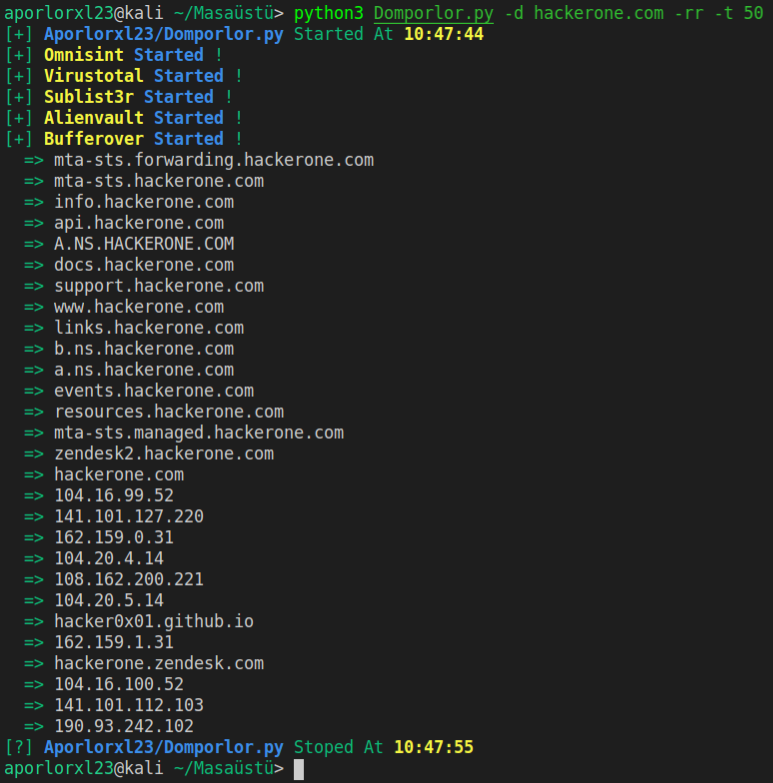

<h1 align="left">
  </a>
  <br>
</h1>

Domporlor is a subdomain discovery tool that discovers valid subdomains for websites by using passive online sources. It has a simple modular architecture and is optimized for speed. Domporlor is built for doing one thing only - passive subdomain enumeration, and it does that very well.

We have designed Domporlor to comply with all passive sources licenses, and usage restrictions, as well as maintained a consistently passive model to make it useful to both penetration testers and bug bounty hunters alike.


# Resources
- [Features](#features)
- [Usage](#usage)

 # Features

<h1 align="left">
  </a>
  <br>
</h1>

 - Simple and modular code base making it easy to contribute.
 - Fast And Powerful Resolution and wildcard elimination module
 
 # Usage

```python
python3 Domporlor.py -h
```
This will display help for the tool. Here are all the switches it supports.

| Flag | Description | Example |
|------|-------------|---------|
| -d   | Domain to find subdomains for | python3 Domporlor.py -d hackerone.com |
| -t   | Number of concurrent goroutines for resolving (default 25) | python3 Domporlor.py -t 50 |
| -r   | Show Resolvers | python3 Domporlor.py -rr |
| -s   | Unverify SSL Certification | python3 Domporlor.py -ss |
